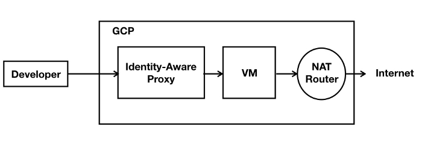

# Cloud Development Environment

This Terraform project creates an instance, a bastion host and a NAT gateway.

**Figure 1.** *diagram of Google Cloud resources*



## Set up the environment

1. Set the project, replace `YOUR_PROJECT` with your project ID:

```
PROJECT=YOUR_PROJECT
```

```
gcloud config set project ${PROJECT}
```

2. Configure the environment for Terraform:

```
gcloud auth application-default login
export GOOGLE_PROJECT=$(gcloud config get-value project)
```

3. Create a terraform.tfvars file with required variables
```
iap_members = ["user:me@example.com"]
```

## Configure remote backend

1. Configure Terraform [remote backend](https://www.terraform.io/docs/backends/types/gcs.html) for the state file.

```
BUCKET=${GOOGLE_PROJECT}-terraform
gsutil mb gs://${BUCKET}

PREFIX=cloud-dev/state
```

```
cat > backend.tf <<EOF
terraform {
  backend "gcs" {
    bucket     = "${BUCKET}"
    prefix     = "${PREFIX}"
  }
}
EOF
```

## Run Terraform

```
terraform init
terraform apply
```

## Testing

1. Establish ssh tunnel between VM and laptop.
```
gcloud compute ssh cloud-dev --tunnel-through-iap
```

## VS Code Setup

https://medium.com/andcloudio/setting-up-development-environment-on-google-cloud-dd91b619cc80


## Cleanup

1. Exit the ssh sessions:

```
exit
```

2. Remove all resources created by terraform:

```
terraform destroy
```
